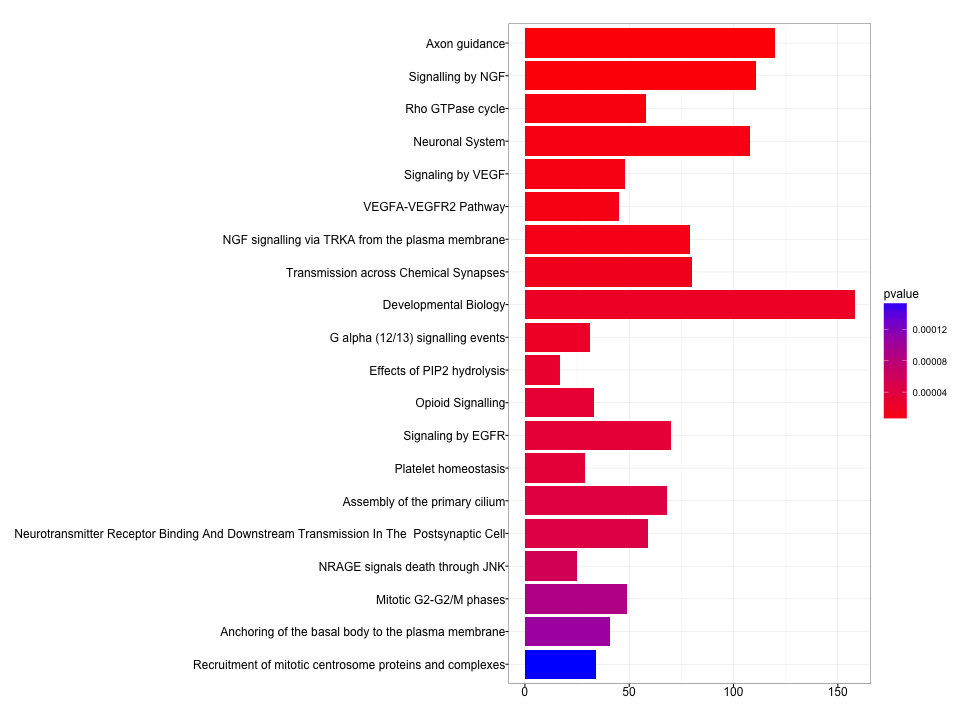

This document will find differentially methylated regions and output a bed file.

```{r setup, include=FALSE}
knitr::opts_chunk$set(cache=TRUE)
```

##Loading the data

These data are preproceed Illumina 450K methylation data. 

- m.norm.combat.rmch.RData is a normalized m value set for the 450K array
- quant_set2.RData is raw data for the methylation data
- AnnotatedCBD_ONLY.csv is an annotated datafile for statisticaly significant differentially meth sites
- 

```{r Loading the Data, message=FALSE}
require(DMRcate)
require(DMRcatedata)
require(minfi)
require(limma)
require(dplyr)
require(tidyr)
require(readr)
library(gage)
library(gageData)
library(pathview)

load(file = file.path(PROJHOME, "Methylation/Output/m.norm.combat.rmch.RData"))
load(file = file.path(PROJHOME, "Methylation/Output/R_workspace/quant_set2.RData"))
pd <- pData(quant.set) #extract the pheno data from the quant.set
data("dmrcatedata") #necessary for removing SNPs in finding DMRs
```

DMRcate is an algorithm developed by Tim Peters to identify differentially methylated regions from differentially methylated sites. It is available on [bioconductor](https://www.bioconductor.org/packages/release/bioc/html/DMRcate.html).

```{r DMRcate with m values, message=FALSE}
m <- combat_m.norm.rmcr[, which(pd$Group == "CBD" | pd$Group == "BeS")] #I only want to analyze the BeS and CBD samples
m.noSNPs <- rmSNPandCH(m, dist=2, mafcut=0.05) #Removes probes with SNPs and non-CG methylation sites
pdCBD <- pd[which(pd$Group == "CBD" | pd$Group == "BeS"), ]  #Pheno data with only the CBD and BeS groups
group <- as.factor(pdCBD$Group)
model <- model.matrix(~0 + group) #Only use the disease group in the model
colnames(model) <- c("BeS", "CBD")
contrast <- makeContrasts(BeS-CBD, levels = model) #Contrast matrix is not necessary for only 2 groups, could just do model.matrix(group)
dmpDMRcate <- cpg.annotate(datatype = "array", object = m.noSNPs,
                           analysis.type = "differential", 
                           design = model, contrasts = T, cont.matrix = contrast, 
                           coef = c("BeS - CBD"), fdr = .001) # Caclculates p.values for individual CpG sites, the false discovery rate cutoff is .001.
DMR <- dmrcate(dmpDMRcate, lambda = 1000) #Uses a kernel model to identify sigificant DMR
DMR.ranges <- extractRanges(DMR, genome = "hg19") #Extracts the ranges and stats for DMRs

#Changes the DMR.ranges table into tbl format
DMR.ranges <- tbl_df(as.data.frame(DMR.ranges))
DMR.ranges <- mutate(DMR.ranges, rangename = rownames(DMR.ranges))
rownames(DMR.ranges) <- NULL
```

Plan for DMR.ranges object: 
1. Make BED file from DMR.ranges table
2. Make a BED file out of M values (or beta values) for the CpG sites (all)
3. Make a UCSC browswer track including both beta/m and DMR values 

##BED file from DMR.ranges table
```{r DMR BEDfile}
#Select only the chrom, start, stop, minfdr rate(stats), Stouffer's score (z-score), and mean betafc for each DMR found above

DMR.BED <- DMR.ranges %>%
    select(seqnames, start, end, minfdr, Stouffer, meanbetafc)

#Save the file for later use
write.table(DMR.BED, file = file.path(PROJHOME, "DMR.bed"), sep = "\t", col.names = F, quote = F)
```

##BED file from B values

```{r beta BEDFILE}
#Read in previously annotated data for CBD and BeS methylation at the CpG level. This table contains stats, beta values, and gene names and locations for CBD and BeS samples

meth.sig <- read_csv(file = file.path(PROJHOME, "Methylation/Output/tables/AnnotatedCBD_ONLY.csv"))

#Select only chr, start, end, strand, mean beta values for BeS and CBD, and adj p value
meth.BED <- meth.sig %>%
    mutate(start = pos, end = pos + 1) %>%
    select(chr, start, end, strand, BeS_Mean, CBD_Mean, adj.P.Val)

#Save file for later use
write_tsv(meth.BED, path = file.path(PROJHOME, "meth.bed"))
```

##Make BedGraphs and bigWig files for UCSC browser tracks

See `run.sh` for the script to make these files from the ones created above.

##Making a UCSC broswers hub to display BeS and CBD methylation and DMRs

hub.txt initializes the hub
```
hub UCSC
shortLabel meth hub
longLabel UCSC Genome Broswer hub for CBD and BeS methylation data
genomesFile genomes.txt
email amanda.richer@ucdenver.edu
```

genomes.txt established the genome reference and gives the location for the trackDb.txt file
```
genome hg19
trackDb results/trackDb.txt
```
trackDb.txt outlines the parameters for the tracks

Note: The container multiWig established an overlapping track for difference samples. In this case, it uses the BeS and CBD methylation beta values

```
track DMR
bigDataUrl DMR.bw
shortLabel DMR
longLabel DMR -log10(fdr)
type bigWig
color 77,175,74
visibility full
maxHeighPixels 150:30:11

track all_meth
container multiWig
shortLabel all_meth
longLabel all_meth
type bigWig 0 30000
viewLimits 0:160
visibility full
aggregate transparentOverlay
showSubtrackColorOnUi on
windowingFunction mean
priority 1.4
configurable on
autoScale on

track BeS
bigDataUrl meth_BeS.bw
shortLabel BeS
longLabel BeS
parent all_meth
type bigWig
color 228,26,28

track CBD
bigDataUrl meth_CBD.bw
shortLabel CBD
longLabel CBD
parent all_meth
type bigWig
color 55,126,184
```

[UCSC Broswer Track](http://genome.ucsc.edu/cgi-bin/hgTracks?db=hg19&hubUrl=http://mandylr.github.io/final_project/UCSC/hub.txt)

## DMR and CpG methylation on Chr6


##Methylation patterns at MUC5B locus


##Pathway Analysis from DMRs

I will use the [ReactomePA](http://www.bioconductor.org/packages/devel/bioc/html/ReactomePA.html) R package to identify enriched pathways and the [clusterProfiler](http://bioconductor.org/packages/release/bioc/html/clusterProfiler.html) R package to visualize the data

```{r DMR Gene Pathways, message=FALSE}
library(ReactomePA)
library(clusterProfiler)
library(org.Hs.eg.db)
DMR_genes <- read_tsv("DMR.genes.bed", col_names = c("chr", "start", "end", "logp", "RefGene", "strand"))

#Filter for -log10(pval) > 50 to narrow down genes
top_DMR <- DMR_genes %>%
    #filter(logp > 25) %>%
    mutate(pval = 10^-logp) %>% 
    inner_join(., DMR.BED) #Adds more stats and beta fold change

genes <- unique(top_DMR$RefGene)

EntrezID <- bitr(genes, fromType = "REFSEQ", toType = "ENTREZID", annoDb = "org.Hs.eg.db") #Change IDs

#Reactome Pathways
enrich <- enrichPathway(gene=unique(EntrezID$ENTREZID),pvalueCutoff=0.05, readable=T)

barplot(enrich, showCategory=20)
dev.copy(png, "DMR_Reactome.png")
dev.off()

#KEGG Pathways
KEGG <- enrichKEGG(unique(EntrezID$ENTREZID), organism = "human", 
                   pvalueCutoff = 0.05, pAdjustMethod = "BH", readable = T)

barplot(KEGG, showCategory = 20)
dev.copy(png, "DMR_KEGG.png")
dev.off()
```

##Reactome Top 20 Enriched Pathways



##KEGG Top 20 Enriched Pathways

